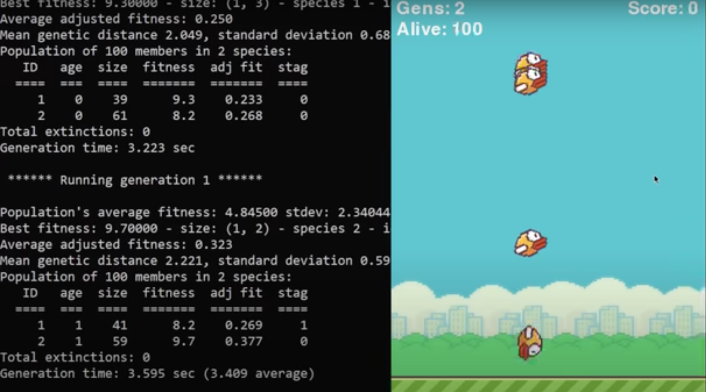
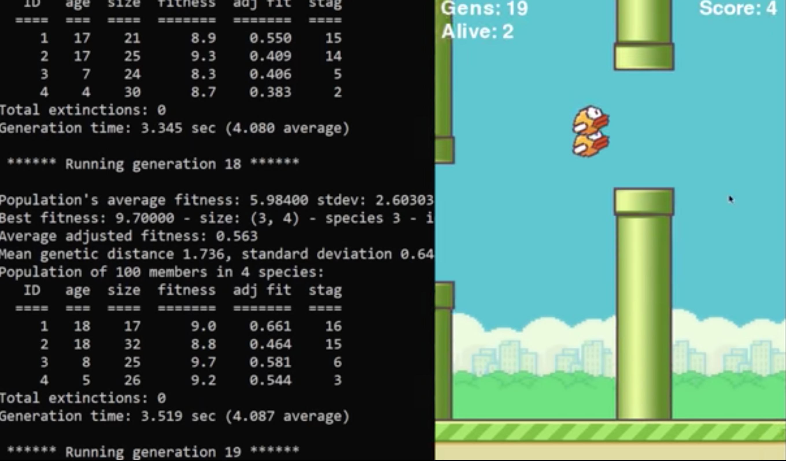
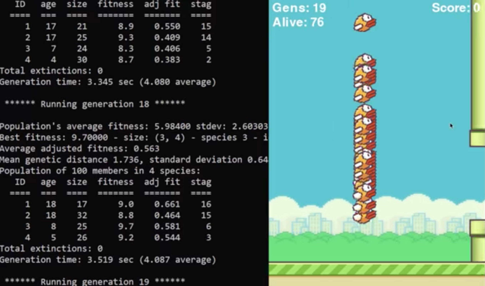

# Flappy Bird
An AI that teaches it self how to play flappy bird, it start off completly random having absolutely no idea what to do and how the gaming would operate, and after many generation of slowly learning and slowly getting better, it's finally picks up on patterns and what it can do to progress forder in the level.

# Requirements
- numpy
- pygame
- neat-python
- graphviz
- matplotlib

# Schema
Simply run *flappy_bird.py* and watch an AI start training itself to play the game of flappy bird!

#### User
- Ask
- type
- answer

### Project

- name: Flappy Bird
- description: textfield
- createdAt: timestamp
- updatedAt: timestamp

### Log
- text: textfield
- createdAt: timestamp
- updatedAt: timestamp
